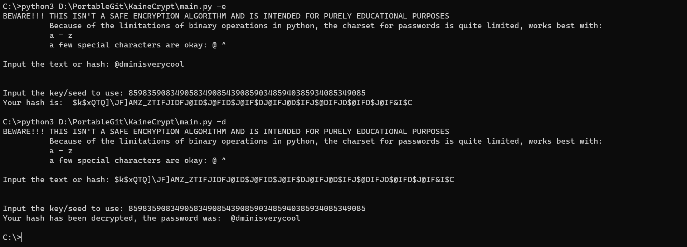

# KaineCrypt
Test encryption algorithm for demonstrational purposes that uses binary manipulation and character replacements.

## Usage
'''bash
KaineCrypt/main.py [-e / -d]

-e or --encrypt to specify you are going to encrypt data
-d or --decrypt to specify you are going to decrypt a KaineCrypt hash'''
